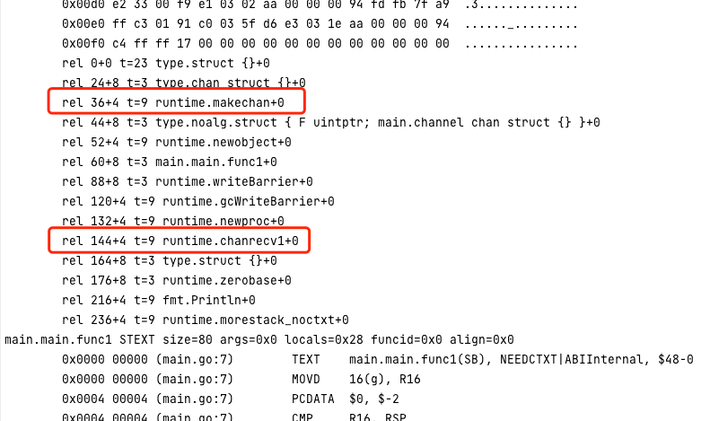
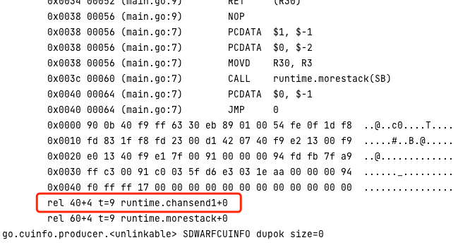

# channel 源码分析

## 先看结论
channel的一些结论应该在初学时就掌握，这里是我根据源码再次总结的，可以先看总结再看源码
- channel的核心组成
  - buf：环形缓冲区，存储元素
  - sendq：发送等待队列，双向链表，存储`sudog`结构，包含着g，管理g的阻塞与唤醒
  - recvq：接收等待队列，双向链表，存储`sudog`结构，包含着g，管理g的阻塞与唤醒
  - mutex：runtime层轻量级互斥锁，在执行发送、接收、正常关闭操作都会加锁。改天与sync.Mutex对比研究下区别
- 发送元素到channel：
  - 发送到一个被关闭的channel报panic
  - 当接收等待队列不为空，直接发送到一个等待的g中
  - 接收等待队列为空
    - 0缓冲区或者缓冲区没有空间，接收直接阻塞
    - 缓冲区有空间就直接放入到发送索引处，不阻塞，直接返回
  - 当一个发送的g被唤醒时，有两种情况
    - 其他的g发生接收操作，成功发送返回
    - 其他的g发生close操作，失败发送，并panic
- 从channel接收元素：
  - 从一个被关闭的channel中接收元素，如果buf中有则返回，没有则返回零值
  - 当发送等待队列不为空，直接从一个发送的g中接收元素
  - 发送等待队列为空
    - 0缓冲区或者缓冲区没有空间，发送直接阻塞
    - 缓冲区有空间就直接从接收索引处取数据，不阻塞，直接返回
  - 当一个接收的g被唤醒时，有两种情况
    - 其他的g发生发送操作，成功接收返回
    - 其他的g发生close操作，失败接收，不发生panic
- 关闭channel
  - 关闭nil的channel报panic
  - 关闭已经关闭的channel报panic
  - 会唤醒所有发送等待队列和所有接收等待队列的g，对应的sudog都标识操作失败，对于发送者会报panic

补充：
- 缓冲区非完全队列：不是完全的一个先进先出队列的结构，当缓冲区没有满，可以认为是并发安全的先进先出队列；当缓冲区满了，则会先去阻塞的g中接收数据
- 等待与唤醒由sudog实现，并非channel独创结构：sudog会包含elem(数据，在channel中是发送的数据地址或接收位置的地址)、g将要阻塞的协程，
并由gopark阻塞将其发送到全局等待队列中，由goready唤醒从全局等待队列中移入调度队列中。GMP模型中提到的调度队列存放的g就是sudog结构
- mutex并非sync.Mutex：channel使用的是runtime.mutex锁，而不是sync.Mutex锁。网上博文常说的`channel也是用mutex实现并发安全`会产生误解

## 基本示例

```go
func main() {
  channel := make(chan struct{})
  go func() {
      channel <- struct{}{}
  }()
  fmt.Println(<-channel)
  close(channel)
}
```
翻译汇编指令，找出runtime执行函数
`go tool compile -N -l -S main.go`




基本可以确定是以下关于channel的runtime调用
1. runtime.makechan 构造channel
2. runtime.chanrecv1 往channel中接收元素
3. runtime.chansend1 往channel中发送元素

在runtime包下全局搜索以上三个函数即可找到源码位置 `runtime/chan.go`

## 创建channel
channel的构造语句是`func makechan(t *chantype, size int) *hchan`
可以看出其中chantype是我们传入的类型，size是channel的缓冲区大小。该函数的返回值是 *hchan，hchan即为channel的构造
```go
type hchan struct {
  qcount   uint           // 在buf中总元素个数
  dataqsiz uint           // 用户构造的buf大小
  buf      unsafe.Pointer // 指向buf缓冲区，可以看作是循环队列
  elemsize uint16         // buf中每个元素的大小
  closed   uint32         // channel是否关闭，0表示未关闭
  elemtype *_type         // 元素类型
  sendx    uint           // channel发送索引位置
  recvx    uint           // channel接收索引位置
  recvq    waitq          // 等待接收的goroutine
  sendq    waitq          // 等待发送的goroutine
  
  lock mutex              // 互斥锁，保证并发安全，不是sync.Mutex，是runtime2.mutex
}

type waitq struct {
  first *sudog
  last  *sudog
}

/*
sudog（或称为 "Scheduling Unit Descriptor"）
用于协程的等待和唤醒机制。
并不是实现channel独有的结构，是用于go整个协程的等待和唤醒
*/
type sudog struct {
  g *g // 可以看出这是一个保存goroutine的双向链表
  
  next *sudog
  prev *sudog

  elem unsafe.Pointer // 与等待相关的数据
  //......
}
```

hchan主要由这四种结构配合实现而成

1. dataqsiz: 环形缓冲区
2. recvq: 发送等待队列(双向链表实现)
3. sendq: 接收等待队列(双向链表实现)
4. mutex: 互斥锁

对于前面校验的部分我们先省略
```go
func makechan(t *chantype, size int) *hchan {

  // mem 是元素类型与缓冲区大小相乘的大小，也就是buf的大小
  mem, overflow := math.MulUintptr(elem.size, uintptr(size))
  if overflow || mem > maxAlloc-hchanSize || size < 0 {
      panic(plainError("makechan: size out of range"))
  }
  // ......
  var c *hchan
  switch {
  case mem == 0:
      // buf大小为0
      // 元素大小为0，比如struct{}，或者缓冲区大小为0，则只需要分配hchan本身的大小内存就行
      // hchanSize是一个常量，大小为空hchan占用的字节大小
      c = (*hchan)(mallocgc(hchanSize, nil, true))
      // buf应该为0，此处的实现是unsafe.Pointer(&c.buf)
      c.buf = c.raceaddr()
  case elem.ptrdata == 0:
      // 元素类型不包含指针
      // c分配的大小为本身空hchan占用的大小 + mem
      c = (*hchan)(mallocgc(hchanSize+mem, nil, true))
      // c.buf指向空hchan末尾，也就是指向mem内存开头
      c.buf = add(unsafe.Pointer(c), hchanSize)
  default:
      // 元素包含指针
      // 为buf单独开辟mem大小的空间，绑定元素类型elem
      c = new(hchan)
      c.buf = mallocgc(mem, elem, true)
  }
  // 设置元素类型大小
  c.elemsize = uint16(elem.size)
  // 设置元素类型
  c.elemtype = elem
  // 设置环形队列buf的大小
  c.dataqsiz = uint(size)
  // 初始化锁，lockInit实现为空
  lockInit(&c.lock, lockRankHchan)
  // ...... 
  return c
}
```

## channel 发送数据

```go
func chansend1(c *hchan, elem unsafe.Pointer) {
  chansend(c, elem, true, getcallerpc())
}
// 发现主要实现是chansend
/*
参数：
1. hchan
2. 要发送元素的首地址
3. 是否阻塞
4. 回调函数
*/
func chansend(c *hchan, ep unsafe.Pointer, block bool, callerpc uintptr) bool {
  // ......
  // 加锁
  lock(&c.lock)
  // 关闭不可以发送，先解锁，然后直接报panic
  if c.closed != 0 {
      unlock(&c.lock)
      panic(plainError("send on closed channel"))
  }
  // 这里的意思是判断等待接收队列是否有元素，有的话直接发送过去
  if sg := c.recvq.dequeue(); sg != nil {
      send(c, sg, ep, func() { unlock(&c.lock) }, 3)
      return true
  }
  // 在等待接收队列为空的情况下
  // 如果环形缓冲区的元素数量 < 环形缓冲区总长度
  // 说明环形缓冲区没有满，直接发送到环形缓冲区中
  if c.qcount < c.dataqsiz {
      // c.sendx 前面我们提到了是索引位置
      // chanbuf 返回指向c.sendx的指针位置
      qp := chanbuf(c, c.sendx)
      if raceenabled {
          racenotify(c, c.sendx, nil)
      }
      // ep 源地址
      // qp 目标地址
      // 复制数据，将ep中的数据复制到qp当中
      typedmemmove(c.elemtype, qp, ep)
      // 自增发送索引位置，如果发现与环形缓冲区总长度相等就置为0
      c.sendx++
      if c.sendx == c.dataqsiz {
          c.sendx = 0
      }
      // 自增缓冲区元素数量
      c.qcount++
      // 解锁
      unlock(&c.lock)
      return true
  }
  // 在等待接收队列为空 && 缓冲区满了
  // 同步非阻塞的情况，直接返回
  if !block {
      unlock(&c.lock)
      return false
  }
  // 在以上条件都不满足，说明此刻没有接收者 && 缓冲区满了 && block
  // 按照我们使用经验，这里要发生阻塞
  // getg() 返回当前goroutine的指针
  gp := getg()
  // acquireSudog() 获取一个sudog对象，用于保存goroutine的信息，最终将会被放入阻塞队列中
  mysg := acquireSudog()
  mysg.releasetime = 0
  if t0 != 0 {
  mysg.releasetime = -1
  }
  // sudog保存了要发送的数据
  mysg.elem = ep
  mysg.waitlink = nil
  // sudog关联g
  mysg.g = gp
  mysg.isSelect = false
  mysg.c = c
  gp.waiting = mysg
  gp.param = nil
  // 等待发送队列增加本goroutine的sudog对象
  c.sendq.enqueue(mysg)
  
  atomic.Store8(&gp.parkingOnChan, 1)
  // gopark() 将当前协程置于等待状态，允许调度器在特定情况下唤醒这个协程
  gopark(chanparkcommit, unsafe.Pointer(&c.lock), waitReasonChanSend, traceEvGoBlockSend, 2)
  // 避免编译器释放ep
  KeepAlive(ep)
  
  if mysg != gp.waiting {
  throw("G waiting list is corrupted")
  }
  gp.waiting = nil
  gp.activeStackChans = false
  closed := !mysg.success
  gp.param = nil
  if mysg.releasetime > 0 {
      blockevent(mysg.releasetime-t0, 2)
  }
  mysg.c = nil
  // goroutine被唤醒完成
  releaseSudog(mysg)
  if closed {
      if c.closed == 0 {
          throw("chansend: spurious wakeup")
      }
      // 因为被关闭而唤醒，直接panic
      panic(plainError("send on closed channel"))
  }
  return true
}
/*
将发送的数据ep直接发送到接收者sg中，之后sg对应的goroutine被唤醒继续执行
*/
func send(c *hchan, sg *sudog, ep unsafe.Pointer, unlockf func(), skip int) {
  
  if sg.elem != nil {
      // 拷贝数据
      sendDirect(c.elemtype, sg, ep)
      sg.elem = nil
  }
  gp := sg.g
  unlockf()
  gp.param = unsafe.Pointer(sg)
  sg.success = true
  if sg.releasetime != 0 {
      sg.releasetime = cputicks()
  }
  // 放毒调度队列，等到被调度
  goready(gp, skip+1)
}

func sendDirect(t *_type, sg *sudog, src unsafe.Pointer) {
  dst := sg.elem
  typeBitsBulkBarrier(t, uintptr(dst), uintptr(src), t.size)
  // 拷贝发送到sg.elem
  memmove(dst, src, t.size)
}
```

channel发送数据总结：
1. 加锁
2. 从头部取出等待接收队列中的sudog，如果有则直接将数据拷贝到sudog.elem中，随后调用goready将此sudog关联的g放入到调度队列中
3. 如果等待接收队列没有sudog，则判断环形缓冲区是否满了，如果没有满，则将数据拷贝到环形缓冲区sendx索引位置处，同时更新下一次拷贝到的索引位置
4. 如果环形缓冲区满了（或是缓冲区大小为0），则需要阻塞发送者，获取本g，获取一个sudog对象，填充sudog对象，包括g和数据。然后将sudog放到到发送阻塞队列中，调用gopark陷入阻塞。
5. 解锁

## channel 接收数据
```go
func chanrecv1(c *hchan, elem unsafe.Pointer) {
  chanrecv(c, elem, true)
}
/*
参数：
1. channel
2. 元素指针 a := <-c中的a地址
3. block 是否阻塞
*/
func chanrecv(c *hchan, ep unsafe.Pointer, block bool) (selected, received bool) {
  
  // 上锁
  lock(&c.lock)
  // 判断channel是否被关闭
  if c.closed != 0 {
      // 关闭情况下
      // 环形缓冲区元素数量为0，直接return
      if c.qcount == 0 {
          if raceenabled {
              raceacquire(c.raceaddr())
          }
          unlock(&c.lock)
          // 清除ep指针区域内存，恢复零值
          if ep != nil {
              typedmemclr(c.elemtype, ep)
          }
          return true, false
      }
      // 环形缓冲区数量不为0
  } else {
      // 未关闭情况下
      // 从发送等待队列中取sudog，如果有则直接接收
      if sg := c.sendq.dequeue(); sg != nil {
          // 将sg中的elem拷贝到ep中，随后恢复sg对应的g的运行
          recv(c, sg, ep, func() { unlock(&c.lock) }, 3)
          return true, true
      }
      // 发送等待队列没有sudog，说明该阻塞了
  }
  // 关闭情况下: 环形缓冲区数量 > 0 || 未关闭情况下: 发送等待队列没有sudog
  // 命中关闭情况下，未关闭情况下，c.qcount > 0
  if c.qcount > 0 {
      // 从环形缓冲区中取出元素拷贝到ep当中，更新接收索引位置，解锁退出
      qp := chanbuf(c, c.recvx)
      if raceenabled {
          racenotify(c, c.recvx, nil)
      }
      if ep != nil {
          typedmemmove(c.elemtype, ep, qp)
      }
      typedmemclr(c.elemtype, qp)
      c.recvx++
      if c.recvx == c.dataqsiz {
          c.recvx = 0
      }
      c.qcount--
      unlock(&c.lock)
      return true, true
  }
  // 不阻塞情况下返回false
  if !block {
      unlock(&c.lock)
      return false, false
  }
  // 命中未关闭情况下，无等待发送者，无缓冲数据
  // 获取本地g
  gp := getg()
  // 获取一个sudog对象
  mysg := acquireSudog()
  mysg.releasetime = 0
  if t0 != 0 {
      mysg.releasetime = -1
  }
  // sudog对象elem设置为目标接收处地址
  mysg.elem = ep
  mysg.waitlink = nil
  gp.waiting = mysg
  mysg.g = gp
  mysg.isSelect = false
  mysg.c = c
  gp.param = nil
  // 将此sudog加入到channel的接收等待队列
  c.recvq.enqueue(mysg)
  atomic.Store8(&gp.parkingOnChan, 1)
  // 将sudog放入到等待队列，并阻塞住
  gopark(chanparkcommit, unsafe.Pointer(&c.lock), waitReasonChanReceive, traceEvGoBlockRecv, 2)
  
  // 被唤醒，说明已经接收到元素了，可以准备后的退出工作
  if mysg != gp.waiting {
      throw("G waiting list is corrupted")
  }
  gp.waiting = nil
  gp.activeStackChans = false
  if mysg.releasetime > 0 {
      blockevent(mysg.releasetime-t0, 2)
  }
  success := mysg.success
  gp.param = nil
  mysg.c = nil
  releaseSudog(mysg)
  return true, success
}

func recv(c *hchan, sg *sudog, ep unsafe.Pointer, unlockf func(), skip int) {
  if c.dataqsiz == 0 {
      if raceenabled {
          racesync(c, sg)
      }
      // 缓冲区大小为0，直接从sg复制到ep
      if ep != nil {
          // copy data from sender
          recvDirect(c.elemtype, sg, ep)
      }
  } else {
      // 在chansend中已经分析过相似的逻辑，将ep复制到接收处，随后更新recvx索引
      qp := chanbuf(c, c.recvx)
      if raceenabled {
          racenotify(c, c.recvx, nil)
          racenotify(c, c.recvx, sg)
      }
      if ep != nil {
          typedmemmove(c.elemtype, ep, qp)
      }
      typedmemmove(c.elemtype, qp, sg.elem)
      c.recvx++
      if c.recvx == c.dataqsiz {
          c.recvx = 0
      }
      c.sendx = c.recvx // c.sendx = (c.sendx+1) % c.dataqsiz
  }
  sg.elem = nil
  gp := sg.g
  unlockf()
  gp.param = unsafe.Pointer(sg)
  sg.success = true
  if sg.releasetime != 0 {
      sg.releasetime = cputicks()
  }
  // 将g放入到调度队列中
  goready(gp, skip+1)
}

func recvDirect(t *_type, sg *sudog, dst unsafe.Pointer) {
  src := sg.elem
  typeBitsBulkBarrier(t, uintptr(dst), uintptr(src), t.size)
  // 从sudog.elem中拷贝到dst(接收者地址)中
  memmove(dst, src, t.size)
}
```

channel 接收数据总结
1. 加锁
2. channel被关闭，并且channel没有数据时，直接清空接收地址恢复零值；如果channel没有被关闭，并且发送等待队列不为空时，直接取出一个sudog，如果buf缓冲区大小大小为0，直接将sudog的元素值赋值给接收地址，否则取出buf接收索引处值赋给接收地址，随后将sudog唤醒，解锁退出
3. 以上不满足并且环形缓冲区元素数量 > 0 （只有关闭时满足了），直接更新接收地址值，更新接收索引，解锁退出
4. 以上不满足说明channel不为空，且没有元素，且接收等待队列为空。将当前g打包成sudog放入到等待队列中，并放入到channel的接收等待队列，等待被唤醒，唤醒
5. 解锁退出

## channel 关闭
在channel用完之后，需要释放
代码中是使用`close(c chan<- Type)`函数来实现的

```go
func closechan(c *hchan) {
  // 关闭一个nil的channel，会直接panic
  if c == nil {
      panic(plainError("close of nil channel"))
  }
  // 加锁
  lock(&c.lock)
  // 已经被关闭，解锁，报panic
  if c.closed != 0 {
      unlock(&c.lock)
      panic(plainError("close of closed channel"))
  }
  // 设置关闭标识
  c.closed = 1
  // 申请一个gList用来存放所有接收等待队列、发送等待队列的g
  var glist gList

  // 唤醒所有接收等待队列的g
  for {
      sg := c.recvq.dequeue()
      if sg == nil {
          break
      }
      if sg.elem != nil {
          // 恢复零值
          typedmemclr(c.elemtype, sg.elem)
          sg.elem = nil
      }
      if sg.releasetime != 0 {
          sg.releasetime = cputicks()
      }
      gp := sg.g
      gp.param = unsafe.Pointer(sg)
      // 没有接收成功
      sg.success = false
      if raceenabled {
          raceacquireg(gp, c.raceaddr())
      }
      // 放入到glist
      glist.push(gp)
  }
  // 唤醒所有发送等待队列的g，它们将会panic
  for {
      sg := c.sendq.dequeue()
      if sg == nil {
          break
      }
      sg.elem = nil
      if sg.releasetime != 0 {
          sg.releasetime = cputicks()
      }
      gp := sg.g
      gp.param = unsafe.Pointer(sg)
      // 没有发送成功
      sg.success = false
      if raceenabled {
          raceacquireg(gp, c.raceaddr())
      }
      // 放入到glist
      glist.push(gp)
  }
  // 解锁
  unlock(&c.lock)

  // 如果glist不为空，goready唤醒所有的g，
  // 这些g的发送或接收动作都没有成功
  // 原先发送等待队列的g将会报panic
  // 原先接收等待队列的g将获取到零值
  // Ready all Gs now that we've dropped the channel lock.
  for !glist.empty() {
      gp := glist.pop()
      gp.schedlink = 0
      goready(gp, 3)
  }
}
```
channel 关闭总结
1. 如果被关闭的channel为nil，直接报panic
2. 加锁
3. 已经被关闭，报panic
4. 设置关闭标识c.closed = 1
5. 取出所有channel等待队列sudog，状态设为false，表示失败操作，申请glist用来存放所有的g
6. 解锁
7. 将所有的g使用goready唤醒，原先发送等待队列的g将会报panic，原先接收等待队列的g将获取到零值


